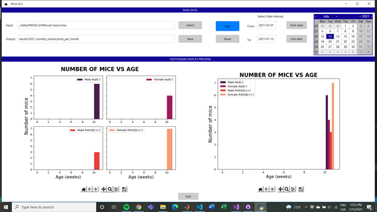
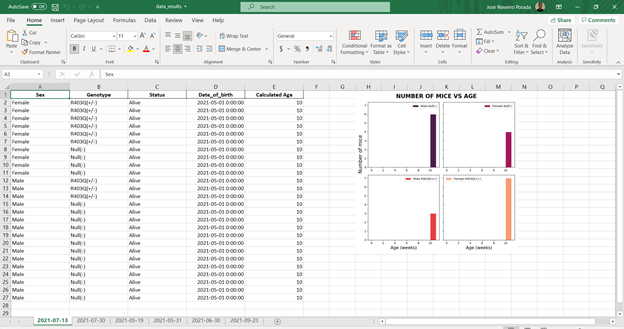

# TheMiceCounter

The Mice Counter is software for managing data of mice litters. The code allows the user to choose specific information of mice, such as id, genotype, sex, date of birth, age, etc. and creates excel files with the chosen data.
  + This software is written in Python's Graphic User Interface extension: Tkinter.

The application works on any computer that has Excel.

## Organization

The main components of the software are:
+ [Run Data](pages/Run Data/Run Data.html) - the core section where the data can be selected.
+ [Histogram Display Preview](pages/Histogram Display Preview/Histogram Display Preview.html) - accessory display where the images created by the simulation can be seen previous to being saved in an excel file. This makes it easier to run different periods of time and analyze output.
  

## Getting started

Check the [demos](pages/demos/demos.html) to see how to:
+ Run simulations
+ Create excel files and/or excel sheets with new data