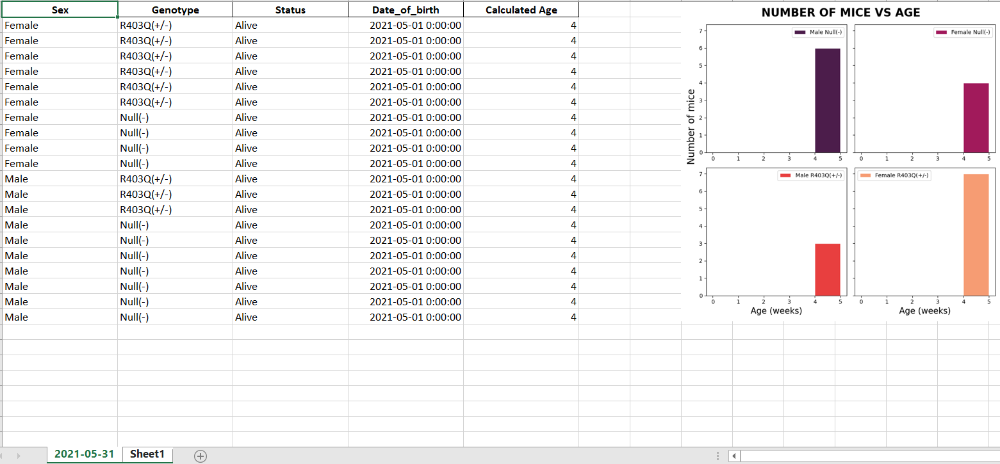

# TheMiceCounter

The Mice Counter is an application for managing data of mice litters. The code allows the user to choose specific information of mice, such as id, genotype, sex, date of birth, age, etc. and creates excel files with the chosen data.
  + This application is written in Python's Graphical User Interface toolkit: Tkinter.

The application works on any computer that has Excel. The result are shown in the following image:

## Organization

The main components of the software are divided into two different frames:
+ [Run Data](pages/Run Data/Run Data.html) - the core section where the input data can be selected.
+ [Histogram Display Preview](pages/Histogram Display Preview/Histogram Display Preview.html) - accessory display where the images created by the simulation can be seen previous to being saved in the excel file. This makes it easier to run different periods of time and analyze the outputs.

## Getting started
Check the [installation](pages/installation/installation.html) to download the application.

Check the [demos](pages/demos/demos.html) to see how to:
+ Introduction to the application
+ Start creating excel files and/or excel sheets with new data