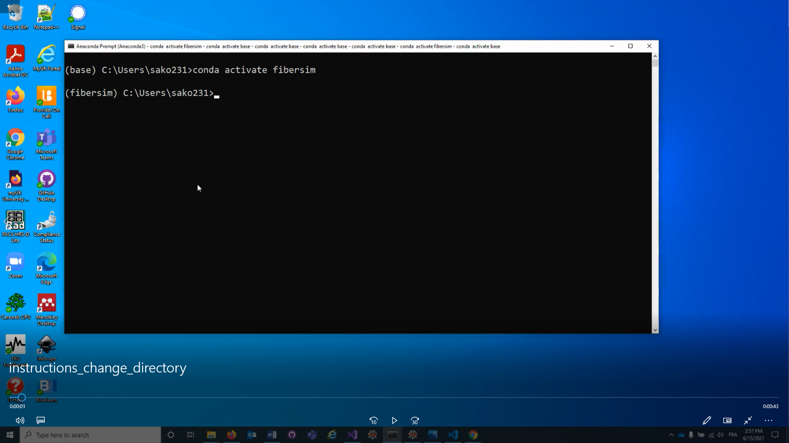
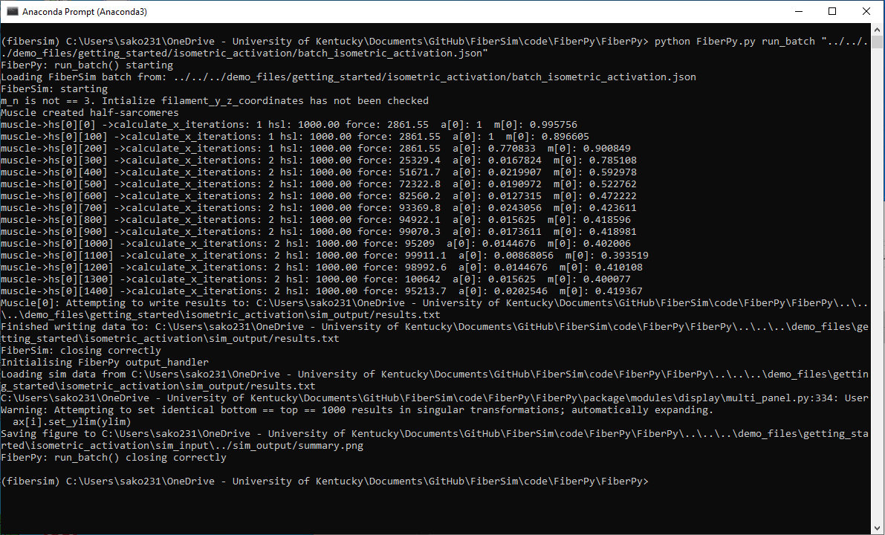

# Step by step

## Overview

This demo shows step by step how to use TheMiceCounter application.

## What this demo does

This demo:

+ Runs a simulation in a new woorkbook sheet of excel
Runs a single simulation in which a half-sarcomere is held isometric and activated in a solution with a pCa of 4.5

+ Plots a summary of the simulation

## Instructions

Before proceeding, make sure that you have followed the [installation instructions](../../../installation/installation.html). You need the FiberSim folder, an Anaconda distribution of Python, and an active FiberSim environment to run this demo.

### Getting ready

+ Open an Anaconda Prompt

+ Activate the FiberSim Anaconda Environment by executing:
```
conda activate fibersim
```
+ Change directory to `<FiberSim_dir>/code/FiberPy/FiberPy`, where `<FiberSim_dir>` is the directory where you installed FiberSim. Here is a short video showing you how to use the `cd` command.

[](https://drive.google.com/file/d/1g90Awaesj1UyHP0lA-S-X5uSDjvw26II/view?usp=sharing)

### Run a simulation

+ Type:
 ```
 python FiberPy.py run_batch "../../../demo_files/getting_started/isometric_activation/batch_isometric_activation.json"
 ```

+ You should see text appearing in the terminal window, showing that the simulations are running. When it finishes (this may take a few minutes), you should see something similar to the image below.



### Viewing the results

All of the results from the simulation are written to files in `<repo>/demo_files/getting_started/isometric_activation/sim_output`


The file `summary.png` shows pCa, length, force per cross-sectional area (stress), and thick and thin filamnt properties plotted against time..


The underlying data are stored in `results.txt`


## How this worked

This demonstration simulated a half-sarcomere that was held isometric and activated in a solution with a pCa of 4.5.

The simulation was controlled by a batch file (shown below) that was passed to FiberPy.

The first few lines, labelled `FiberSim_batch` tell FiberPy where to find the `FiberCpp.exe` file which is the core model.

The rest of the file defines a single `job`. FiberPy passes the job to the core model which runs the simulation and saves the results.

Each job consists of:

+ a model file - which defines the properties of the half-sarcomere including the structure, and the biophysical parameters that define the kinetic schemes for the thick and thin filaments
+ a protocol file - the pCa value and information about whether the system is in length control or force-control mode
+ an options file - which can be used to set additional criteria
+ a results file - which stores information about the simulation

````
{
    "FiberSim_batch": {
        "FiberCpp_exe":
        {
            "relative_to": "this_file",
            "exe_file": "../../../bin/FiberCpp.exe"
        },
        "job":[
            {
                "relative_to": "this_file",
                "model_file": "sim_input/model.json",
                "options_file": "sim_input/options.json",
                "protocol_file": "sim_input/pCa45_protocol.txt",
                "results_file": "sim_output/results.txt",
                "output_handler_file": "sim_input/output_handler.json"
            }
        ]
    }
}
````

The last entry in the job is optional and defines an output-handler. In this example `output_handler.json` was

````
{
    "templated_images":
    [
        {
            "relative_to": "this_file",
            "template_file_string": "../template/template_summary.json",
            "output_file_string": "../sim_output/summary.png"
        }
    ]
}
````

This instructed FiberPy to:
+ take the simulation results
+ create a figure using the framework described in the `template_summary.json` file
+ save the data to `../sim_output/summary.png`

